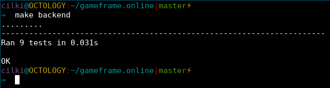

# GameFrame

Gaming database and analytics platform

---

## Meet the Team

Andrew Rieder - 
Tyler Cook - 
Ekin Soysal - 
Devin Drawhorn - Frontend, Selenium
Mitchell Marshe - 
Sam Faulkner - 

---

## Demonstration

+++

---

## Self-Critique

+++

### What We Did Well

- Met at least once a week
- Communicated consistently
- Stayed on top of GitHub issues
- Gathered and organized a large amount of data
- Effectively distributed the workload

+++

### What Did We Learn

- Using libraries makes life easier
- Write more test-friendly code
- Developing for multiple browsers and devices can be a challenge
- How to connect disparate data

+++

### What Can We Do Better

- Set up our testing framework earlier
- Come up with an initial design plan
- Fix ESLint errors earlier (coding styles)
- Make the carousel dynamic

+++

### What Still Puzzles Us

- Good testing practices
- Mystery performance issues
- Microsoft Edge issues
  - Spaces in URLs
  - CSS support
  - Web driver bug

---

## The Working Men Critique

+++

### What Did They Do Well

- They improved their 'about' page design considerably
- Their dataset was unique
- They addressed our user stories in a timely fashion
- The graphs on their instance pages were very attractive
- Their site is fast

+++

### What Did We Learn From Them

- They found a filtering bug on our website
- Use graphs to visualize data
- Leverage GitHub issues even more

+++

### What Can They Do Better

- *Don't* commit database credentials
- *Don't* commit 'node\_modules'
- Add summaries for instances
- Make site mobile friendly

+++

### What Still Puzzles Us

- Do people want to know the physician-population ratio?
- Why do the instance headers just link to the thumbnail images? (Why isn't the picture on the page?)
- Why couldn't they fix the image scaling?

---

## Visualization
